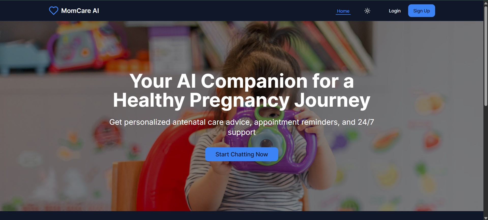

# MOMCARE – Your AI Companion for a Healthy Pregnancy 🤰🤖

MOMCARE is an AI-driven chatbot designed to support pregnant women with **personalized health guidance, emotional well-being tips, and nutritional advice**. Leveraging advanced AI, MOMCARE ensures that expectant mothers receive **accurate and timely information** for a safe and comfortable pregnancy journey.



## 📌 About
MOMCARE is more than just an assistant—it's a **trusted companion** for every stage of pregnancy. Whether you're looking for expert health tips, mindfulness exercises, or help with appointment reminders, our AI-powered platform is here to **support you every step of the way**.

## 🔥 Features

- 💡 **Pregnancy Health Tips** – Get expert recommendations tailored to your pregnancy stage.  
- 🧘‍♀️ **Emotional Support & Mindfulness** – Reduce stress with AI-driven mental well-being assistance.  
- ⏰ **Appointment & Medication Reminders** – Stay on track with important check-ups and medications.  
- 🗣 **AI Chatbot** – 24/7 access to personalized pregnancy advice and support.  
- 👩‍⚕️ **Telehealth & Doctor Consultations** – Connect with healthcare professionals easily.  
- 🗺 **Nearby Hospital Mapping** – Locate the nearest medical centers instantly.  
- 📈 **Automatic Health Report Generation** – Keep track of your progress with ease.  
- 📚 **Educational Resources** – Access a comprehensive library of health-related articles.  
- 📂 **Medical Document Uploads** – Easily store and access important medical records.  
- 🌍 **Multi-Language Support** – Get assistance in different languages.  
- ⌚ **Integration with Wearable Devices** – Sync health data for real-time insights.  
- 🚨 **Emergency Assistance** – Quick access to emergency healthcare services.  

---
## 📊 Dashboard Highlights
- We believe your dashboard should be your pregnancy command center. Here are the essential features you’ll find on the MOMCARE dashboard:
- Current Week of Pregnancy – Stay aware of your pregnancy progress.
- Doctor Appointment Tracker – View and manage doctor visits for this week/month.
- Class Schedule (Yoga & Wellness) – Know about upcoming wellness or prenatal yoga sessions.
- BP Chart – Monitor your blood pressure over time.
- Sugar Chart – Keep track of blood sugar levels.
- Weight Chart – Watch your healthy weight gain through the weeks.
- Medicine Reminders – Never miss a dose with built-in alerts.
- Profile Overview – Access all personal pregnancy data in one place.
---

## 🛠️ Tech Stack

- 🖥 **Frontend**: React.js ⚛️  
- 📡 **Backend**: Node.js 💻  
- 🗄 **Database**: MongoDB 🍃  
- 🧠 **AI/ML**: Python (TensorFlow, Scikit-learn) 🧬  
- ☁ **Cloud Services**: AWS/GCP ☁  
- 🔗 **API Integrations**: Healthcare APIs, Wearable Devices, Telehealth Services  

---

## 🚀 How to Run Locally

Want to contribute or explore the project? Follow these steps:


### Clone the repository:
```sh
git clone https://github.com/yourusername/MOMCARE.git
```
Install dependencies:
```sh
npm install
```
Start the development server:
```sh
npm run dev
```
Backend Setup:
```sh
cd backend
npm install
node server.js
```

## 🎯 Roadmap
🚀 Future enhancements we plan to introduce:
- 🔍 Advanced AI Diagnostics – More accurate health predictions.
- 🍽 Personalized Nutrition Plans – AI-driven meal recommendations.
- 🌎 Global Language Expansion – More multilingual support.
- ⌚ Wearable Device Compatibility – Enhanced tracking and analytics.

## 🤝 Contributing
We love contributions! If you have ideas to improve MOMCARE, feel free to fork the repo, make changes, and submit a pull request. Let's make pregnancy healthier and safer together! 💙👶

## 👥 Contributors
Sahil Adhikari 
Aditya Verma 
Aditi Roy 

Stay healthy, stay informed, and enjoy your pregnancy journey with MOMCARE! 💖👩‍⚕️🤰
